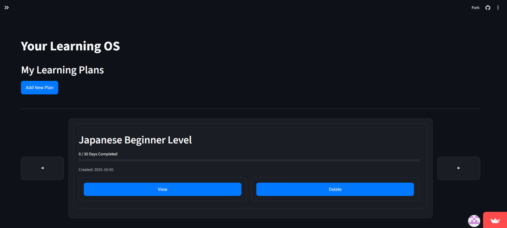
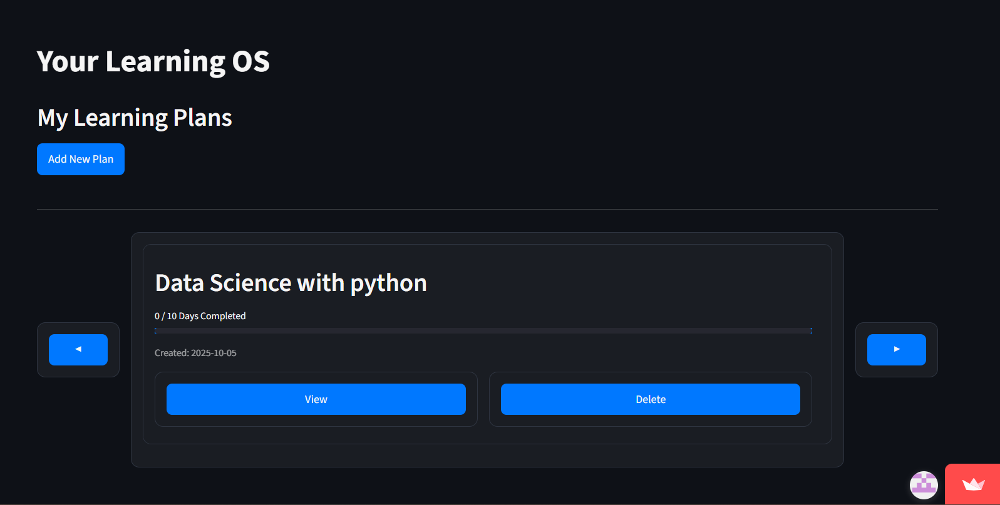
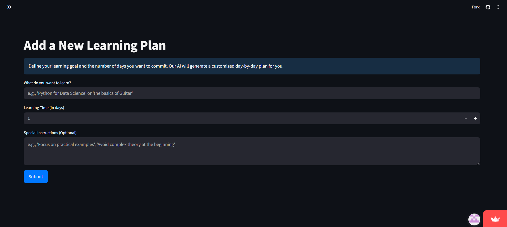

# AI Tutor · An AI teacher who teaches better than your college one.

> **AI Tutor** is an intelligent web platform that lets learners define their own study goals and timelines, then builds a fully personalized learning experience — from planning to daily materials, practice, and progress tracking.

Click for Demo : https://porsugu-hakathon-main-uq04zd.streamlit.app/
---

## ✨ Features

### 🎯 Goal-Oriented Learning
- Define **custom learning goals** and set your own completion time.
- Generate **personalized study plans** that adapt to your schedule and target skills.

<figure>
  

    
  

  <figcaption align="center">Dashboard — personalized learning plans overview</figcaption>
</figure>

### 📂 Multi-Plan Management
- Create and manage **multiple study plans** at once.
- Switch easily between subjects or learning targets.

<figure>
  

    
  

  <figcaption align="center">Dashboard — Multi Plan changing</figcaption>
</figure>

### 🧠 AI-Powered Learning for Each Plan
1. **Collaborative Plan Refinement** – Adjust and negotiate the plan with an LLM (Large Language Model).
<figure>
  

    
  

  <figcaption align="center">Dashboard — personalized learning plans overview</figcaption>
</figure>

2. **Daily Learning Materials** – Auto-generate day-by-day lessons tailored to your progress. 
<figure>
  

    <video controls src="20251005-1807-27.4695182.mp4" style="width:70%;"></video>
  

  <figcaption align="center">Learn Today - To get more informations by asking the chat box.</figcaption>
</figure>

3. **Knowledge Tracking** – Store and organize key knowledge points in a personal database.  
<figure>
  

    
  

  <figcaption align="center">Dashboard — personalized learning plans overview</figcaption>
</figure>

<figure>
  

    
  

  <figcaption align="center">Dashboard — personalized learning plans overview</figcaption>
</figure>

4. **Practice Generation & Feedback** – AI creates **short-answer & multiple-choice** questions, then explains why your answers are right or wrong.  
<figure>
  

    
  

  <figcaption align="center">Dashboard — personalized learning plans overview</figcaption>
</figure>

<figure>
  

    
  

  <figcaption align="center">Dashboard — personalized learning plans overview</figcaption>
</figure>

5. **On-Demand Knowledge Expansion** – Instantly add extra knowledge related to your plan, update your database, and refine your study needs anytime.
<figure>
  

    
  

  <figcaption align="center">Dashboard — personalized learning plans overview</figcaption>
</figure>

### 🌍 Current Focus
- Full **text-based support** for language learning (complete and functional).  
- **Cross-platform foundation** ready for web and future mobile expansion.

---

## 🚧 Work in Progress / Roadmap

- **🔑 Login & User Database Integration**  
  - Login page is nearly finished, but **user ID ↔ database linking** needs refinement.
- **➗ Mathematics & Coding Plans**  
  - AI-driven teaching quality is under active improvement for these subjects.
- **🗣️ Enhanced Language Learning**  
  - Future integration with **Snowflake AI voice system** to enrich speaking & listening experience.

---

## 🧱 Tech Stack

- **Frontend:** Streamit, CSS 
- **Backend:**  Database (SQLite3)  
- **AI:** Large Language Models (LLM-based content generation & tutoring), Gemini API  
- **Auth:** Google OAuth (will be out soon)  
- **Infra & Deployment:** Streamlit deployment

---

## 👭🏻👬🏻Groupmates
Arthur Lam
Donald Chan
Joycelyn Tsang
Anastasiia Kim

